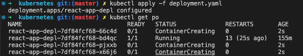
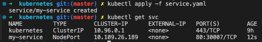
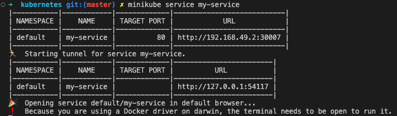
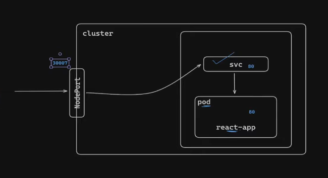

# Kubernetes

This project was bootstrapped with [Create React App](https://github.com/facebook/create-react-app).

```
minikube start
kubectl config current-context
kubectl get namespace

```
## Pods
A pod is the smallest unit of work in k8s. It's a way to package up one or more containers with shared resources and

pods- Pods are the smallest deployable units of computing that you can create and manage in Kubernetes.

this template cannot be autoscaled when -> kind: Pod
to achieve autoscaling we do deployment

pods.yaml - example
```
apiVersion: v1
kind: Pod
metadata:
  name: <pod_name>
spec:
  containers:
  - name: <pod_name>
    image: <image_name>
    ports:
    - containerPort: 80    ---- the pod port

```
Create-pod: kubectl apply -f pod.yaml
status: kubectl get po -o wide

kubectl describe pod <pod_name>
kubectl delete pod <pod_name>


## Deployment
Deployments - Deployment is a type of controller in Kubernetes that automates the rolling update, scaling, and cleanup of pods.

https://kubernetes.io/docs/concepts/workloads/controllers/deployment/

kubectl apply -f deployment.yaml

deployment.yaml - example
```
apiVersion: apps/v1
kind: Deployment
metadata:
  name: <pod_name>
spec:
  replicas: <num_of_replicas>
  selector:
    matchLabels:
      app: <pod_name>
  template:
    metadata:
      labels:
        app: <pod_name>
    spec:
      containers:
      - name: <pod_name>
        image: <image_name>
        ports:
        - containerPort: 80    ---- the pod port
```



## Service
To expose a pod to the network, we need to use services.

Service is an abstraction which defines a logical set of Pods and a policy by which to access them — creating a virtual network port on which

https://kubernetes.io/docs/concepts/services-networking/service/

kubectl apply -f service.yaml
kubectl get svc   

- Services help to expose the application
- three types
    - cluster IP
    - Node port 
    - load balancer

service.yaml
```
apiVersion: v1
kind: Service
metadata:
  name: my-service
spec:
  type: NodePort
  selector:
    app.kubernetes.io/name: MyApp
  ports:
    - port: 80    ---- the service port
      # By default and for convenience, the `targetPort` is set to
      # the same value as the `port` field.
      targetPort: 80    ---- the pod port
      # Optional field
      # By default and for convenience, the Kubernetes control plane
      # will allocate a port from a range (default: 30000-32767)
      nodePort: 30007
```



## Accessing service

minikube service my-service



## Structure


