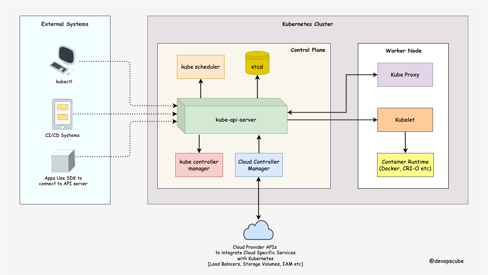

# Kubernetes

This project was bootstrapped with [Create React App](https://github.com/facebook/create-react-app).

```
minikube start
kubectl config current-context
kubectl get namespace

```
## Pods
A pod is the smallest unit of work in k8s. It's a way to package up one or more containers with shared resources and

pods- Pods are the smallest deployable units of computing that you can create and manage in Kubernetes.

this template cannot be autoscaled when -> kind: Pod
to achieve autoscaling we do deployment

pods.yaml - example
```
apiVersion: v1
kind: Pod
metadata:
  name: <pod_name>
spec:
  containers:
  - name: <pod_name>
    image: <image_name>
    ports:
    - containerPort: 80    ---- the pod port

```
Create-pod: kubectl apply -f pod.yaml
status: kubectl get po -o wide

kubectl describe pod <pod_name>
kubectl delete pod <pod_name>


## Deployment
Deployments - Deployment is a type of controller in Kubernetes that automates the rolling update, scaling, and cleanup of pods.

https://kubernetes.io/docs/concepts/workloads/controllers/deployment/

kubectl apply -f deployment.yaml

deployment.yaml - example
```
apiVersion: apps/v1
kind: Deployment
metadata:
  name: <pod_name>
spec:
  replicas: <num_of_replicas>
  selector:
    matchLabels:
      app: <pod_name>
  template:
    metadata:
      labels:
        app: <pod_name>
    spec:
      containers:
      - name: <pod_name>
        image: <image_name>
        ports:
        - containerPort: 80    ---- the pod port
```


## Service
To expose a pod to the network, we need to use services.

Service is an abstraction which defines a logical set of Pods and a policy by which to access them — creating a virtual network port on which

https://kubernetes.io/docs/concepts/services-networking/service/

kubectl apply -f service.yaml
kubectl get svc   

- Services help to expose the application
- three types
    - cluster IP
    - Node port 
    - load balancer

service.yaml
```
apiVersion: v1
kind: Service
metadata:
  name: my-service
spec:
  type: NodePort
  selector:
    app.kubernetes.io/name: MyApp
  ports:
    - port: 80    ---- the service port
      # By default and for convenience, the `targetPort` is set to
      # the same value as the `port` field.
      targetPort: 80    ---- the pod port
      # Optional field
      # By default and for convenience, the Kubernetes control plane
      # will allocate a port from a range (default: 30000-32767)
      nodePort: 30007
```


## Accessing service

minikube service my-service


## Structure


## Architecture
https://devopscube.com/kubernetes-architecture-explained/

The kubernetes cluster has two main component it is 
the control plane and 
the worker node

so the worker node is a
virtual machine in which your
application will be deployed or
application will be running so there can
be multiple nodes more than one nodes so
as your application keeps on building or
when the traffic to your application
becomes significant you increase the
number of node uh to support the
application 

the flow of data - let's imagine that
you run the command Cube c-f deployment.
DML what is happening in the background
let's imagine that so the command is
going to reach to cube API server so

Cube API server is the point in which we
interact with any command that you write
or any cic system or any sdks they are
all interacting with Cube API server so
the first thing that the cube API server
is going to do is authentication and
authorization it's going to make sure
that the person who is trying to connect
or make changes to the cluster is an
authenticated and authorized Personnel
so once the authentication completes you
can see all these arrows going going up
and down I'll be going I'll be not going
into detail but I'll give a high level
overview so etcd is nothing but uh it is
a distributed database it also
considered as the brain so it is going
to store the state of the cluster and
here we are having the cube scheduler so
Cube scheduler plays a vital role so
here we have entered the deployment. AML
apply a command right so Cube scheduler
what it is going to do is that so the
deployment file has got a port to deploy
and that Port has got a requirement
right so each Port will be having
different requirement like um some Port
will be having high memory requirement
which which is basically dependent on
the application some Port will have less
memory requirement so what Cube
scheduler is going to do is that it is
going to go to this particular node or
the number of nodes that are there so
let's imagine that there are five node
so Cube sched is going to go to each of
this node and I'm going to compare the
requirement of the port and the
requirement that the node has so if the
node has the resources that is the
memory and the computational power to to
accommodate the port then the cube
scheduler is going to assign the port to
be deployed in that particular node I
hope that you guys got it so it uses a
system called as filtering and scoring
it is going to filter the node based
upon the uh compute resources required
for the port and then it is going to
assign one so if five of the node is
capable of deploying the port then a
random node will be selected so once the
node has been selected Cube scheduler is
going to mention that to uh Cube API
server C Cube API server node number one
is capable of holding holding or
deploying this particular Port you can
deploy that there and now what Cube API
server is going to do is that it is
going to contact the cubelet of that
particular node that is node one and it
is going to tell cuet that hey you would
install this particular Port you are
capable of doing that and then cuet is
going to use container runtime interface
that is CRI like Docker or CRI d or to
pull the image from the registry and go
and run it and thus you'll be having an
application running in a worker not so Q
proxy proxy uh is what connects the
entire thing together it is the network
part which helps the communication the
discovery and all these things that is
done by Cube proxy so here you can see
that cicd systems can also communicate
with Cube API server so in a real life
scenario uh personally I use as should
devops so in that case this cicd
pipeline is what is going to manipulate
the cluster so on behalf of me the cicd
system will access the QB AP server and
uh s can also access the server like if
you're having a python application or
any sort of backend application learning
uh so you can use the SDK to access the
cluster as well




ref: https://www.youtube.com/watch?v=YbpobPVhjSA